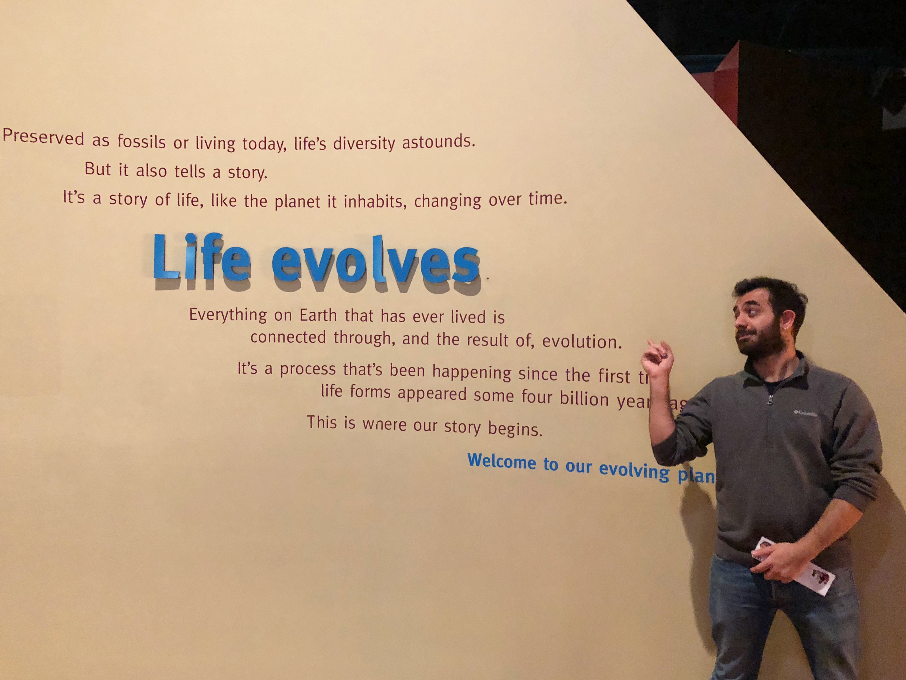

I am currently a third year PhD student in the Schwartz Lab and my main research interests include phylogenomics, bioinformatics, and genomics.

I received my masters (Zoology) degree from Hacettepe University, TR. In my masters, I examined effects of climate change on the distribution patterns of certain vertebrate species including a reptile, a bird and a mammal, particularly in broad (Europe) and small (Anatolia) geographic scales. If interested, you can find my master’s thesis and publications through my Google Scholar & ResearchGate link.

Nowadays, I am working on adaptive/rapid radiation patterns across bird clades. I use genomic data & reconstructed phylogenetic trees to understand adaptive radiation patterns. 

Besides writing code, I am a huge fan of outdoor activities such as camping, bird-watching, hiking, and climbing! Also I like to be active in academic & student organizations. I am currently Vice President of Graduate Student Association of University Rhode Island and executive board member of Ecology and Evolutionary Biology Society of Turkey.