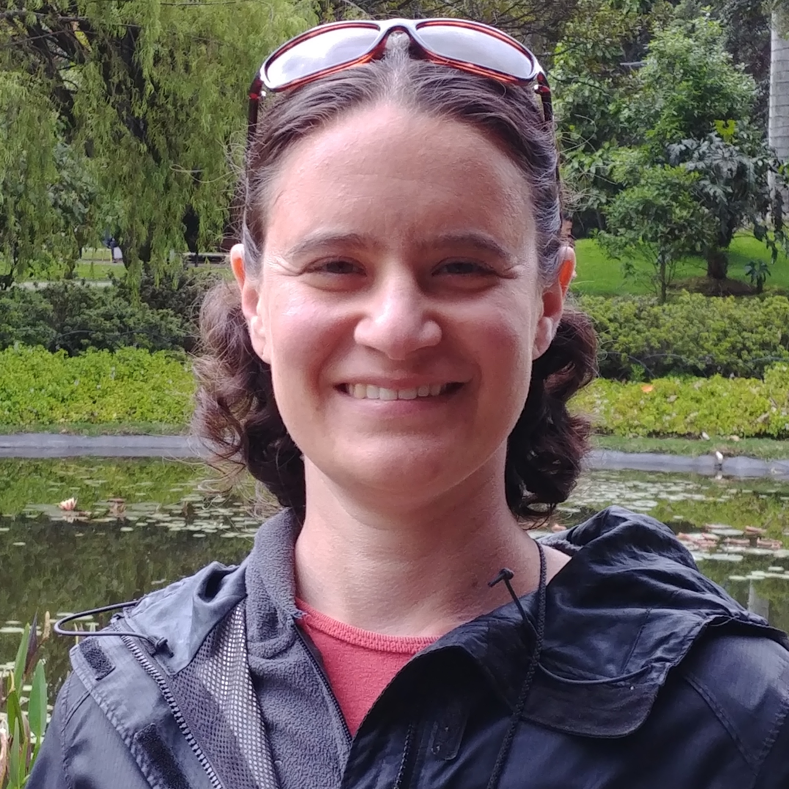
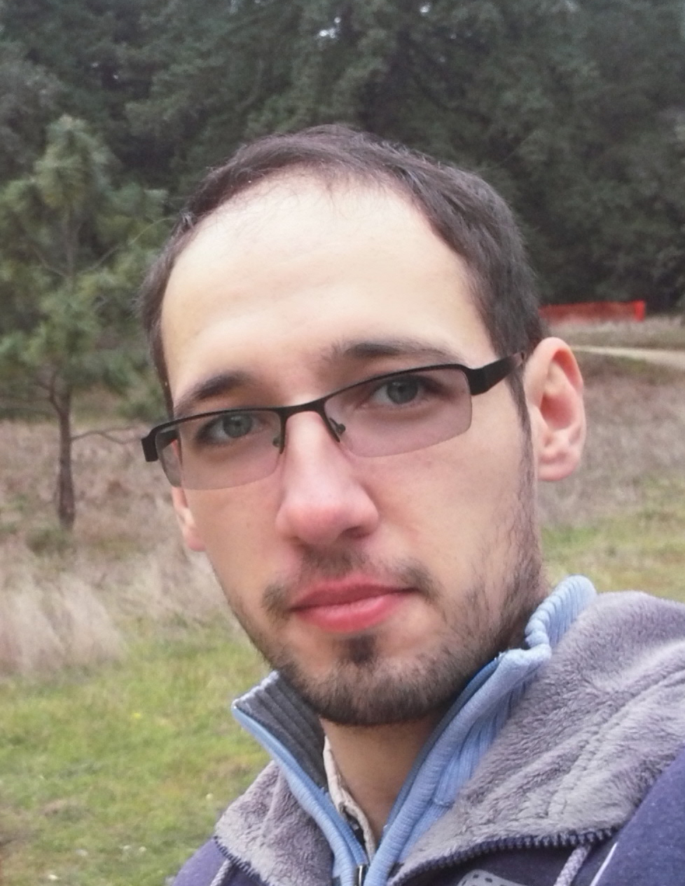
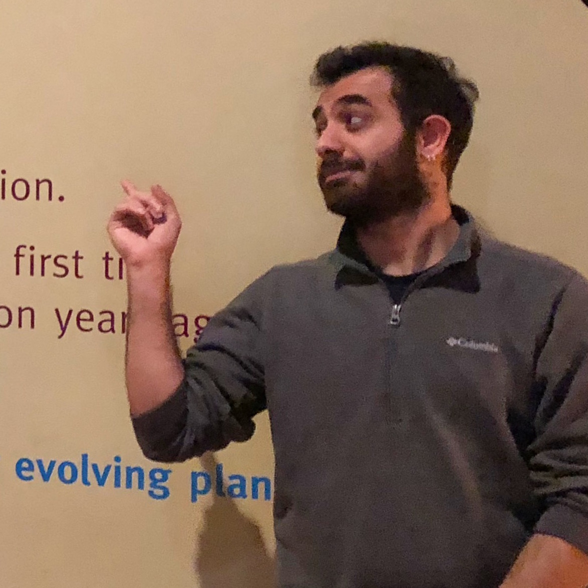

```{r setup, include=FALSE}
knitr::opts_chunk$set(echo = FALSE)
```

## PI



Rachel Schwartz is an Assistant Professor at the University of Rhode Island. I run a dry lab focused on computational evolutionary genetics. My interest is in developing methods to understand evolution, with a particular focus on how we analyze large genomics datasets. I also have an interest in reproducible research and in teaching research skills to students and other researchers.

<i class="fa fa-twitter fa-lg"></i> [rachelss](https://twitter.com/rachelss)

<i class="fa fa-github fa-lg"></i> [Github](https://github.com/rachelss)

<i class="fa fa-github fa-lg"></i> [Lab Github](https://github.com/schwartzlaburi)

<i class="fa fa-google fa-lg"></i> [Google Scholar](https://scholar.google.com/citations?user=z-xKqyIAAAAJ&hl=en)

<i class="fa fa-envelope-o fa-lg"></i> [Email](mailto:rsschwartz@uri.edu)

<i class="fa fa-file fa-lg"></i>[CV]()

<br clear="all">

<hr>

## Postdoctoral Researchers


<br><br>
Alex Knyshov is a Postdoctoral Researcher working on examination of phylogenomic datasets using a variety of computational tools, including machine learning.

<i class="fa fa-envelope-o fa-lg"></i> [Email](aknyshov@uri.edu)

<i class="fas fa-browser fa-lg"></i> [Website](https://alexknyshov.github.io)

<i class="fa fa-github fa-lg"></i> [Github](https://github.com/AlexKnyshov)

<i class="fa fa-twitter fa-lg"></i> [Twitter](https://twitter.com/AlexKnyshov)

<i class="fa fa-google fa-lg"></i> [Google Scholar](https://scholar.google.com/citations?user=UA5LFugAAAAJ)
<br clear="all">
<hr>

## Graduate Students


<br><br>
[Eren Ada](eren.html) is a PhD student in the Schwartz Lab whose research interests include phylogenomics, bioinformatics, and genomics.

<i class="fa fa-twitter fa-lg"></i> [ErenAda](https://twitter.com/erenada)

<i class="fa fa-github fa-lg"></i> [Github](https://github.com/erenada)

<i class="fa fa-google fa-lg"></i> [Google Scholar](https://scholar.google.com/citations?user=MNRPBIkAAAAJ&hl=en)

<i class="fa fa-envelope-o fa-lg"></i> [Email](mailto:erenada@uri.edu)

<i class="fas fa-browser fa-lg"></i> [Website](https://erenada.github.io/)

<br clear="all">

Yana Hrytseno is a PhD student in Computer Science working with Dr. Noah Daniels and in the Schwartz Lab. Yana's research interests include computational biology, population and cancer genomics. Her work is directed towards discovering broad-scale similarities between different types of cancer.

<i class="fa fa-github fa-lg"></i> [Github](https://github.com/YanaHrytsenko)

<i class="fa fa-envelope-o fa-lg"></i> [Email](mailto:yana_hrytsenko@my.uri.edu)

<br clear="all">

Leann Biancani will be joining the lab in Fall 2021 as a PhD student in the BES program. Leann got her BS at Brown University and then continued at Brown as a Lab Manager and Research Assistant for David Rand. She then moved to the University of Maryland for her Masters. Before starting her PhD, Leann taught at the Wheeler School.

<hr>
## Undergraduates

Jewel Voyer (URI BIO '22) is using SISRS to examine relationships among the genus Ixodes.

Alyssa Hartmann (URI BIO '21) is identifying cellulose synthase genes across mosses to determine how this gene family arose.

<hr>
## Alumni

### Postdocs 

<br clear="all">

<br><br>
[Dr. Tejashree Modak](https://tejashree1modak.github.io/) was a postdoctoral researcher in the lab who characterized copy number variation in the Eastern Oyster genome. She is currently a bioinformatics scientist with [Pillar Biosciences](https://pillar-biosciences.com/).

<i class="fa fa-envelope-o fa-lg"></i> [Email](mailto:tejashree@uri.edu)

<br clear="all">


<br><br>
[Dr. Robert (Bob) Literman](bob.html) was an NSF Postdoctoral Fellow developing computational methods to identify and classify high-information and low-information subsets of phylogenomics data. He is currently an ORISE Fellow with the FDA.

<i class="fa fa-twitter fa-lg"></i> [BobLiterman](https://twitter.com/BobLiterman)

<i class="fa fa-github fa-lg"></i> [Github](https://github.com/BobLiterman)

<i class="fa fa-envelope-o fa-lg"></i> [Email](mailto:literman@uri.edu)

<br clear="all">
<hr>

### Undergraduates

Caitlin Guccione (URI MS Applied Math '20 and CS '20) applied machine learning methods to SISRS output to categorize potentially misleading information in phylogenetic markers. She is currently a PhD student at UCSD in Bioinformatics.

Alexandra (Lexi) Johnson (URI BIO '20) worked on using SISRS to examine relationships among the genus Solanum.

Fidaa Janoudi (URI ESM '20) worked in the lab as an undergraduate to develop a website for undergraduates to understand the research done at URI. She is currently a Masters student at URI.

Tiantian Gousie (URI BIO '20) was an undergraduate in the lab who used SISRS to examine how different datasets result in different phylogenies in birds. She is currently a Research Assistant at Salve Regina University.

Devin McConnell (URI CS '19) worked on updating and documenting SISRS code. He is currently a PhD student at UConn in CS.

Baizat Ibrahim (URI CMB '19) is currently in a post-baccalaureate pre-medical program.

AY Akintomide (URI CMB '20)

Nicholas Barone (URI Kinesiology '19) is currently a Medical Scribe.

Talia Santos (URI BIO '18)

